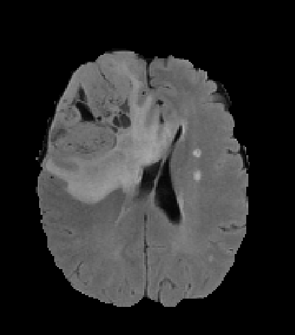
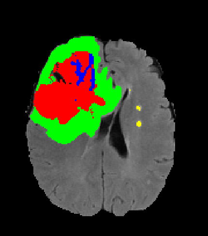

# README

## Overview

This repository accompanies the *Multi-disease segmentation of glioblastoma and white matter hyperintensities in BraTS 2018* paper submitted to Frontiers in Computational Neuroscience.

It is primarily intended for code peer review rather than general consumption.

## U-Net model for brain tumor segmentation

The module [`unet.py`](unet.py) implements a U-Net style encoder-decoder model, in the `mxnet` deep learning framework, for the voxelwise segmentation of BraTS 2018 data.

The main training notebook is [`training_all.ipynb`](training_all.ipynb), which will train on the entire training set, with hyperparameters reasonably optimized via internal cross validation on the training set. This was run multiple times to obtain a bagged ensemble set of models.

The main prediction notebook is [`predict_val.ipynb`](predict_val.ipynb), which will predict BraTS validation cases based on an ensemble of models trained above.

## Chronic small vessel ischemic disease (SVID)

Modifications were made to investigate the joint prediction of non-tumor white matter injury related to chronic small vessel ischemic disease (SVID). 5 channel segmentation included background (label = 0), necrotic/nonenhancing tumor (label = 1), edema (label = 2), SVID (label = 3), and enhancing tumor (label = 4).

The `*_svid5.ipynb` notebooks contain the modifications needed to retrain the model to additionally segment SVID. (The training notebook will obviously not run unless the additional manual segmentations are available.)

| Brats18_TCIA10_261_1_flair.nii.gz    | 5 channel segmentation (with SVID)        |
| -                                    | -                                         |
|  |  |

## 4D inputs

For each subject, input FLAIR, T1, T1CE, T2, and (where applicable) segmentation .nii.gz files were combined into a single 4D NIfTI file using the [`convert_to_4D.R`](convert_to_4D.R) script. These notebooks presume such files are available.

## Data normalization

Subject-wise and input-channel-wise data normalization was performed using whole-brain mean and standard deviation as calculated in [`data_normalization.ipynb`](data_normalization.ipynb).

## Notebooks

At the very least, paths will need to be updated for your local environment.

| Filename                                                             | Mode      | Dataset     | Comments                                       |
| -                                                                    | -         | -           | -                                              |
| [**`training_all.ipynb`**](training_all.ipynb)                       | Training  | Training    | Main parent notebook                           |
| [`training_all_svid5.ipynb`](training_all_svid5.ipynb)               | Training  | Training    | Modified for 5 class prediction including SVID |
| [`training_cv.ipynb`](training_all.ipynb)                            | Training  | Training CV |                                                |
| [`training_cv_svid5.ipynb`](training_all.ipynb)                      | Training  | Training CV | Modified for 5 class prediction including SVID |
| [`predict_val.ipynb`](predict_val.ipynb)                             | Inference | Validation  |                                                |
| [`predict_val_svid5.ipynb`](predict_val_svid5.ipynb)                 | Inference | Validation  | Modified for 5 class prediction including SVID |
| [`predict_training_cv.ipynb`](predict_training_cv.ipynb)             | Inference | Training CV |                                                |
| [`predict_training_cv_svid5.ipynb`](predict_training_cv_svid5.ipynb) | Inference | Training CV | Modified for 5 class prediction including SVID |